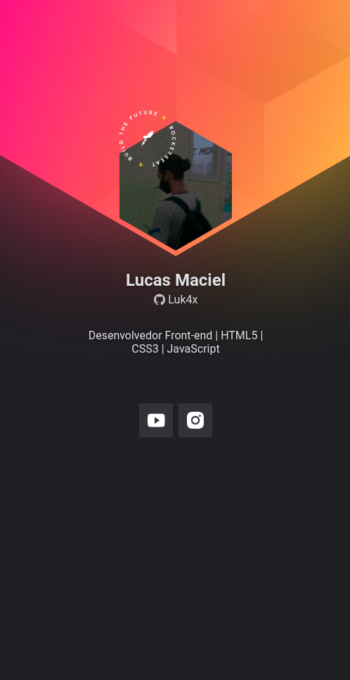

<table align="right">
  <tr>
    <td>
      <a href="readme-en.md">🇺🇸 English</a>
    </td>
  </tr>
  <tr>
    <td>
      <a href="README.md">🇧🇷 Português</a>
    </td>
  </tr>
</table>


# 📛 Github Badge Project

<div align="center">
  
</div>

> Access the project online **[HERE](https://luk4x.github.io/nlw-Heat-Origin-/)**

## 🚀 Technologies Used

-   [Javascript](https://developer.mozilla.org/en-US/docs/Web/JavaScript)
-   [CSS](https://developer.mozilla.org/en-US/docs/Web/CSS)
-   [HTML](https://developer.mozilla.org/en-US/docs/Web/HTML)

## 📝 About

This project consists of a Mobile-First web application developed during the NLW Heat Origin of [Rocketseat](https://www.rocketseat.com.br/), where I create a badge for myself, fetching information directly from the Github API.

### 📌 Some Highlights

- Mobile-First concept applied;
- Asynchronous programming
- Use of [Javacript FetchAPI](https://developer.mozilla.org/en-US/docs/Web/API/Fetch_API);
- Responsiveness;

## 📖 Cloning the Project

To clone and run this project on your computer, you just need [Git](https://git-scm.com/) to be previously installed.<br>
After that, in the terminal:

```bash
# Clone this repository with:
> git clone https://github.com/Luk4x/nlw-Heat-Origin-.git

# Enter the repository with:
> cd nlw-Heat-Origin-

# Run the project with:
> start index.html # For Windows users
> open index.html # For Linux/Mac users
```

## 🤝 Contributor Contact

<table border="2">
  <tr>
    <td align="center">
      <details>
        <summary>
          <b><a href="https://cursos.alura.com.br/vitrinedev/lucasmacielf">Vitrine.Dev</a> 🪟</b>
          <table>
            <tr>
              <td align="center">
                <a href="https://github.com/Luk4x">
                  
                </a>
                <br>
                <a href="https://www.linkedin.com/in/lucasmacielf/">
                  <sub>
                    <b>Lucas Maciel</b>
                  </sub>
                </a>
              </td>
            </tr>
          </table>
        </summary>

| :placard: Vitrine.Dev | Lucas Maciel |
| -------------  | --- |
| :sparkles: Name        | **📛 Github Badge**
| :label: Technologies | javascript, css, html
| :camera: Img         | 

</details>
</td>
</tr>
</table>
